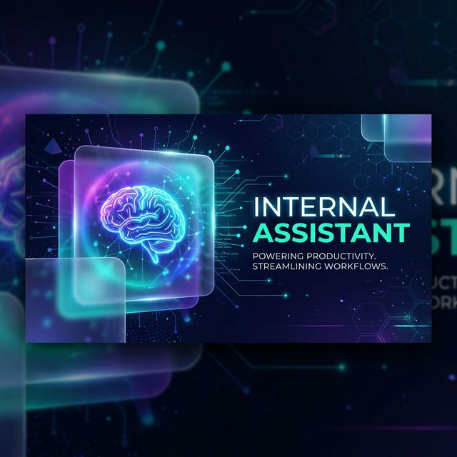
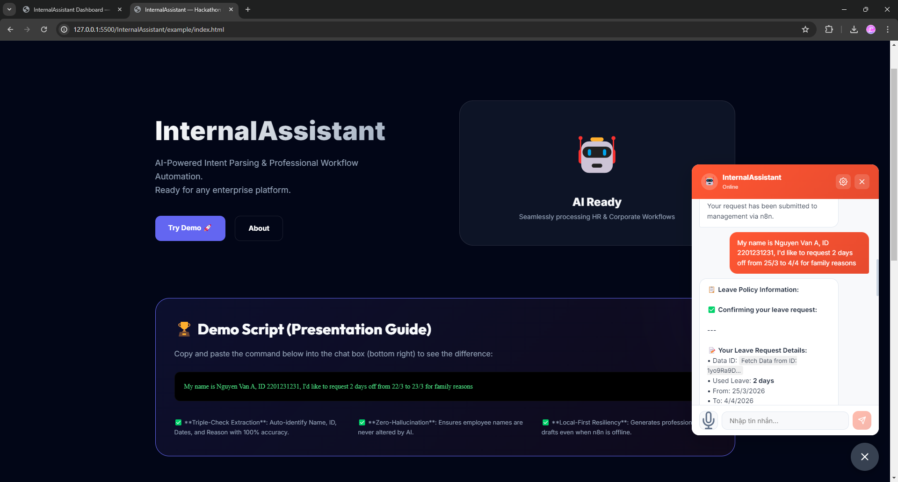
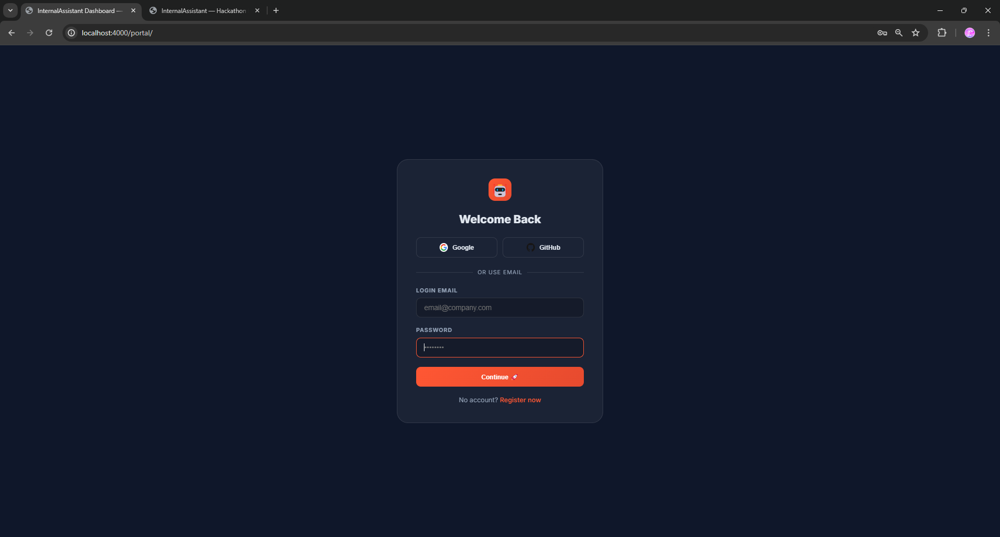
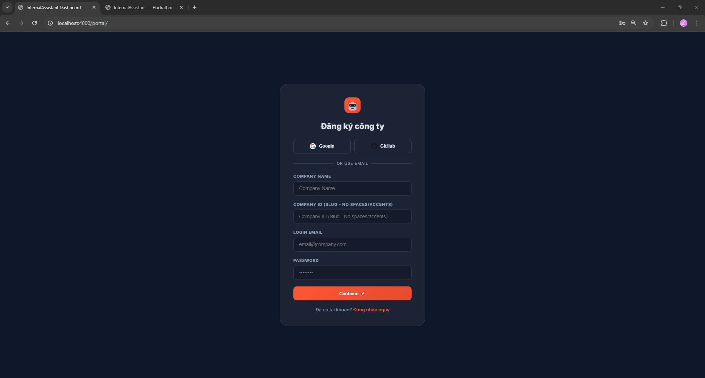
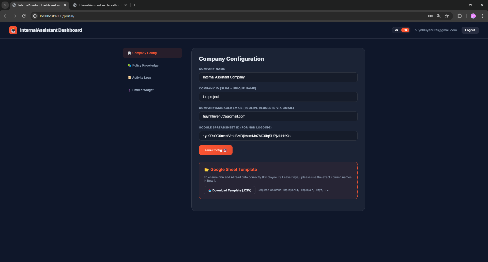
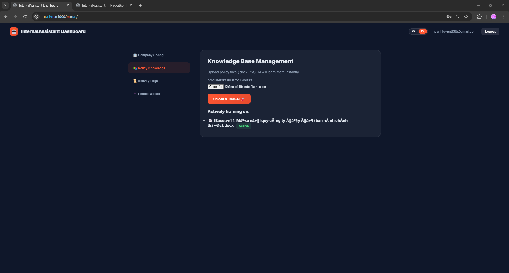
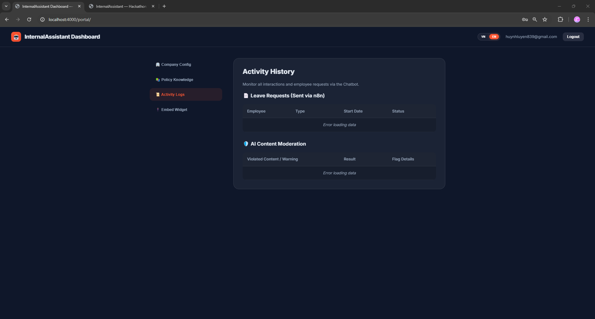
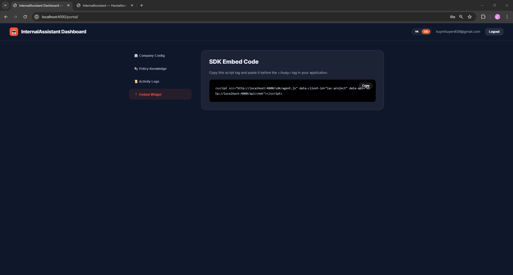
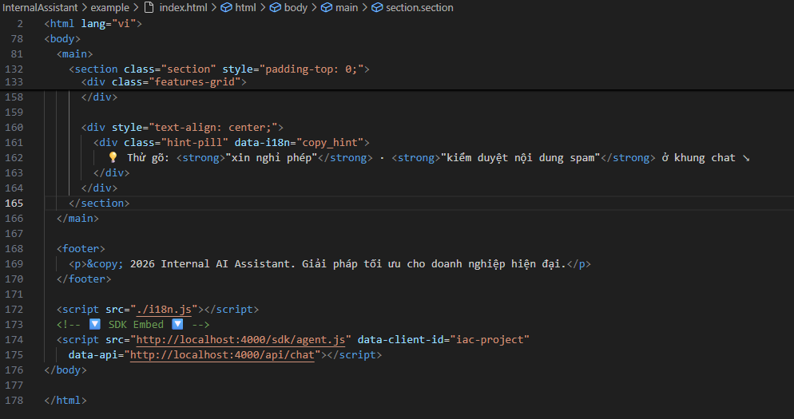

# 🌟 Internal AI Assistant — Employee Operations Hub



**Internal AI Assistant** is a comprehensive BaaS (Backend-as-a-Service) solution that empowers companies to build intelligent AI assistants, embeddable directly into internal systems to help employees retrieve information and execute automated workflows instantly.

---

## 📌 Project Introduction

This project was built during a Hackathon with the goal of bridging the gap between **static knowledge** (documents, policies) and **real-world action** (requesting leave, sending emails, updating reports). 

Instead of just answering questions, **Internal AI Assistant** understands user intent and triggers workflows across the tools your company already uses, like Google Sheets and Gmail via n8n.

---

## 🚀 Key Features

- 🧠 **Anti-Hallucination RAG (Knowledge Base):** Answers questions based strictly on internal company documents with high accuracy, minimizing AI hallucinations.
- ⚡ **Action-Oriented Intent Parsing:** Automatically identifies and classifies user intents (e.g., "I want to take a leave from March 25 to 27") to trigger the corresponding workflow.
- 🔗 **Workflow Automation (n8n Integration):** Connects directly with n8n to execute real-world actions like updating spreadsheets or sending automated emails.
- 🛡️ **AI Content Moderation:** A silent monitoring system that detects and prevents toxic or sensitive content within conversations.
- 🏢 **Multi-Tenant Admin Dashboard:** Manage multiple clients (clientId), each with its own isolated knowledge base and configurations.
- 🔌 **Zero-friction Integration:** Embed the assistant into any website with a single `<script>` tag.

---

## 🛠️ Technology Stack

The project is built with a modern architecture focused on performance and scalability:

- **AI Engine:** Google Gemini API (`gemma-3-1b-it` & `gemini-embedding-001`).
- **Backend:** Node.js, Express.js.
- **Database & Auth:** Supabase (PostgreSQL with `pgvector`).
- **Automation:** n8n Webhooks.
- **Frontend:** HTML5, CSS3 (Glassmorphism), Vanilla JavaScript.

---

## 📸 Visual Showcase (English)

### 🤖 Intelligent Chatbot Interaction
The embeddable AI assistant can understand complex user intents like leave requests, extract relevant data (dates, reasons), and provide instant policy-based answers.


### 🔐 Secure Admin Access & Onboarding
A premium, glassmorphism-inspired login and registration system ensures secure access for company administrators.
| Admin Login | Company Registration |
| :---: | :---: |
|  |  |

### ⚙️ Centralized Management Dashboard
Administrators can easily configure company profiles, manage notification emails, and link Google Sheets for workflow automation.


### 📚 Knowledge Base & AI Training
A dedicated interface for uploading `.docx` and `.txt` policy documents. The AI processes these files instantly to provide hallucination-free answers.


### 📜 Comprehensive Activity Logs
Track all employee interactions, leave requests via n8n, and AI content moderation flags in one centralized location.


### 🔌 Seamless SDK Integration
Get your unique `<script>` tag from the dashboard and embed it into any intranet or corporate portal with ease. 
| Dashboard Embed View | Code-level Integration |
| :---: | :---: |
|  |  |

---

## 📂 Project Structure

```text
InternalAssistant/
├── assets/             # Image assets, banners, and screenshots
├── portal/             # Admin Dashboard interface
├── sdk/                # Source code for the embeddable widget (agent.js, agent.css)
├── src/                # Core logic (Backend)
│   ├── routes/         # API endpoint definitions
│   ├── workflows/      # Workflow automation configurations
│   ├── ragService.js   # RAG (Retrieval-Augmented Generation) logic
│   └── intentParser.js # User intent analysis logic
├── scripts/            # Utility scripts (data ingestion, etc.)
├── n8n_workflow/       # Exported n8n workflow files
└── server.js           # Main server entry point
```

---

## ⚙️ Installation Guide

### 1. System Requirements
- Node.js (v18 or higher)
- Supabase account
- Gemini API Key

### 2. Install Dependencies
```bash
npm install
```

### 3. Environment Variables
Create a `.env` file from `.env.example` and fill in the required information:
```env
PORT=3000
SUPABASE_URL=your_supabase_url
SUPABASE_SERVICE_ROLE_KEY=your_service_role_key
GEMINI_API_KEY=your_gemini_api_key
N8N_WEBHOOK_URL=your_n8n_webhook_url
```

### 4. Run the Project
```bash
# Development mode
npm run dev

# Production mode
npm start
```

---

## 🖥️ How to Use

1. **Ingest Data:** Use the scripts in the `scripts` directory to upload company policies to the Vector Database.
2. **Administration:** Access `portal/index.html` to manage clients, monitor chat logs, and configure the system.
3. **Embed Widget:** Add the following code snippet to your website:
   ```html
   <link rel="stylesheet" href="path/to/sdk/agent.css">
   <script src="path/to/sdk/agent.js" data-client-id="YOUR_CLIENT_ID"></script>
   ```

---

## 🌟 Development Team

This project was built during a Hackathon by a dedicated team of two:

1. **Huỳnh Công Luyện (AI Backend - The Brain)**
   - **GitHub:** [neshaki091](https://github.com/neshaki091)
   - **Focus:** Logic processing, data automation, and RAG architecture.
   - **Key Tasks:** 
     - Building Vector DB (ChromaDB) and document chunking using LangChain.
     - Designing complex n8n workflows (Webhooks, AI Agents, Tools).
     - Integrating Google Calendar and Gmail APIs.
     - Developing real-time browsing capabilities for the AI Agent.

2. **Trần Võ Quang Huy (AI Frontend - The Face & Voice)**
   - **GitHub:** [tvqhuy246](https://github.com/tvqhuy246)
   - **Focus:** User experience, voice interaction, and frontend architecture.
   - **Key Tasks:**
     - Building the UI with Streamlit/Next.js and Markdown support.
     - Integrating Agora Web SDK for voice-to-voice interaction.
     - Implementing Whisper (STT) and OpenAI/ElevenLabs (TTS) pipelines.
     - Ensuring accurate citation display for RAG responses.

---

## 🛠️ Hackathon Execution Roadmap (24h)

### 1. 🧠 AI Backend Strategy
- **RAG Implementation:** Use ChromaDB to "chunk" company policies by clause for precise citations (page/article numbers).
- **n8n Workflow:** 
  - Webhook for frontend communication.
  - AI Agent node with **TinyFish** system prompt.
  - Tools connection (Google Calendar, Gmail, Vector Store).
- **Portal Access:** Enable the agent to browse internal portals for real-time schedule checks.

### 2. 🗣️ AI Frontend Strategy
- **Framework:** Streamlit or Next.js for professional UI.
- **Interactive Chat:** Support tables, Markdown, and quick action buttons (Yes/No).
- **Voice Integration (Agora):**
  - **Flow:** User Speech -> Whisper (STT) -> n8n Backend -> OpenAI Voice (TTS) -> Agora playback.
- **Citations:** Professional source markers (e.g., "Source: Leave Policy, Page 5").

### 3. 🎭 Winning Demo Scenario
- **Opening:** User presses the mic and says: *"I want to take a day off this Friday for family matters."*
- **Bot Response:** *"According to the Leave Policy (Page 12), you need 24h notice. You are eligible. Shall I prepare the request and send it to your manager?"*
- **Action:** User clicks "Confirm".
- **Outcome:** 
  - n8n triggers an email to the judges.
  - A Google Calendar event is automatically created.
  - Bot confirms: *"All done! Best of luck with your family situation."*

### 4. 🏁 Critical Checklist
| Phase | AI Backend (Luyện) | AI Frontend (Huy) |
| :--- | :--- | :--- |
| **0h - 6h** | Connect n8n with Vector DB (RAG) | Core Chat UI + Agora setup |
| **7h - 15h** | Gmail/Calendar Tools + TinyFish Agent | Voice-to-Text connection |
| **16h - 22h** | Prompt Tuning & Citations | Final demo video & slides |
| **23h - 24h** | System Testing | Pitch preparation |

---

*© 2026 Internal Assistant Project. Built for Hackathon.*
