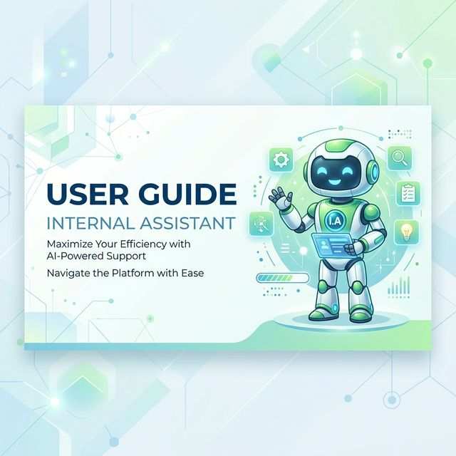

# 📖 Hướng dẫn sử dụng — Internal AI Assistant

Chào mừng bạn đến với **Internal AI Assistant**! Tài liệu này sẽ hướng dẫn bạn cách thiết lập và quản trị hệ thống Trợ lý AI nội bộ cho doanh nghiệp của bạn.

---

## 📑 Mục lục
1. [Đăng ký & Đăng nhập](#-đăng-ký--đăng-nhập)
2. [Cấu hình Công ty](#-cấu-hình-công-ty)
3. [Quản lý Cơ sở Kiến thức (Knowledge Base)](#-quản-lý-cơ-sở-kiến-thức-knowledge-base)
4. [Theo dõi Lịch sử Hoạt động](#-theo-dõi-lịch-sử-hoạt-động)
5. [Tích hợp Widget vào Website](#-tích-hợp-widget-vào-website)
6. [Tương tác với Chatbot](#-tương-tác-với-chatbot)

---

## 🔐 Đăng ký & Đăng nhập

Hệ thống hỗ trợ 2 phương thức chính để bạn truy cập vào Dashboard quản trị:
- **Đăng nhập nhanh:** Sử dụng tài khoản **Google** hoặc **GitHub**.
- **Tài khoản riêng:** Đăng ký bằng Email và Mật khẩu của công ty.

> [!NOTE]
> Lần đầu tiên đăng nhập, bạn sẽ được yêu cầu cung cấp tên công ty và một mã định danh duy nhất (Slug).

### 🔐 Interface Preview (English)
| Admin Login | Company Registration |
| :---: | :---: |
|  |  |

---

## 🏢 Cấu hình Công ty

Trong tab **"Cấu hình Company"**, bạn cần thiết lập các thông số quan trọng để AI hoạt động đúng:

- **Tên công ty:** Tên hiển thị chính thức của doanh nghiệp.
- **Company ID (Slug):** Đây là mã định danh duy nhất (ví dụ: `ia-corp`). Mã này sẽ được dùng trong code tích hợp.
- **Email quản lý:** Địa chỉ email sẽ nhận các thông báo tự động (ví dụ: đơn xin nghỉ phép của nhân viên).
- **Google Spreadsheet ID:** Nhập ID của trang tính Google Sheet để n8n có thể ghi lại các yêu cầu nghỉ phép.

> [!TIP]
> Bạn có thể tải **File mẫu (.CSV)** ngay trong tab này để biết cách cấu hình các cột dữ liệu (EmployeeId, Name, v.v.) sao cho AI có thể đọc đúng.

### ⚙️ Dashboard: Company Config (English)
This screen allows you to manage your company profile and automation settings.

---

## 📚 Quản lý Cơ sở Kiến thức (Knowledge Base)

Đây là nơi bạn "huấn luyện" AI hiểu về chính sách của công ty:

1. Chuyển sang tab **"Tài liệu Policy"**.
2. Chọn tệp tài liệu (hỗ trợ định dạng `.docx` và `.txt`).
3. Nhấn **"Upload & Huấn luyện AI"**.
4. Hệ thống sẽ phân tích dữ liệu và cập nhật vào bộ nhớ của Trợ lý AI ngay lập tức.

### 📚 Dashboard: Knowledge Management (English)
Manage your policy documents and monitor AI training status.

---

## 📜 Theo dõi Lịch sử Hoạt động

Tab **"Lịch sử hoạt động"** giúp bạn giám sát mọi hoạt động của nhân viên trên hệ thống:

- **📄 Đơn nghỉ phép:** Theo dõi danh sách nhân viên đã gửi yêu cầu nghỉ phép qua AI, bao gồm loại nghỉ, ngày bắt đầu và trạng thái xử lý từ n8n.
- **🛡️ Kiểm duyệt nội dung (AI Moderation):** Xem các tin nhắn bị AI gắn cờ (Flagged) do chứa nội dung độc hại, nhạy cảm hoặc spam. Điều này giúp đảm bảo môi trường làm việc chuyên nghiệp.

### 📜 Dashboard: Activity History (English)
Monitor all interactions, automated workflows, and moderation logs in real-time.

---

## 🔌 Tích hợp Widget vào Website

Để nhúng Trợ lý AI vào website nội bộ hoặc cổng thông tin nhân viên:

1. Vào tab **"Mã nhúng Widget"**.
2. Copy đoạn mã script hiển thị trong khung.
3. Dán đoạn mã này vào ngay trước thẻ đóng `</body>` trong mã HTML trang web của bạn.

### 🔌 SDK Integration Details (English)
Obtain your unique script tag from the dashboard and integrate it at the code level effortlessly.
| Dashboard View | Code Implementation |
| :---: | :---: |
|  |  |

---

## 🤖 Tương tác với Chatbot

Sau khi tích hợp, nhân viên có thể sử dụng Trợ lý AI cho các tác vụ:

- **Tra cứu chính sách:** *"Quy trình xin nghỉ ốm như thế nào?"*, *"Công ty có hỗ trợ tiền ăn trưa không?"*.
- **Thực hiện hành động:** *"Tôi muốn xin nghỉ phép từ ngày 25/03 đến 27/03 vì lý do cá nhân"*.
- **Xác nhận quy trình:** Chatbot sẽ hỏi lại thông tin để xác nhận trước khi gửi đơn lên hệ thống thông qua n8n.

### 🤖 Chatbot Experience (English)
Full natural language understanding for employee requests and policy lookups.

---

*Chúc bạn có những trải nghiệm tuyệt vời cùng Internal AI Assistant!*
